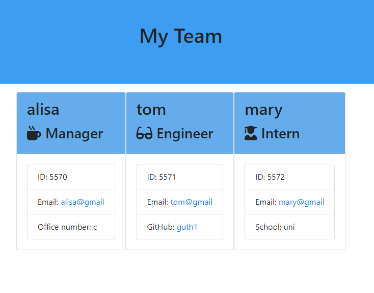

# teamGenerator
# Info
For this project, I created a team generator that displays a team's basic info
so that one have quick access to emails and GitHub profiles

# Specs
I used NPM Inquirer package to prompt the user for their email, id, and specific information based on their role with the company. *This app runs as a Node CLI to gather information about each employee.
I used Jest for testing to ensure that everything works.

